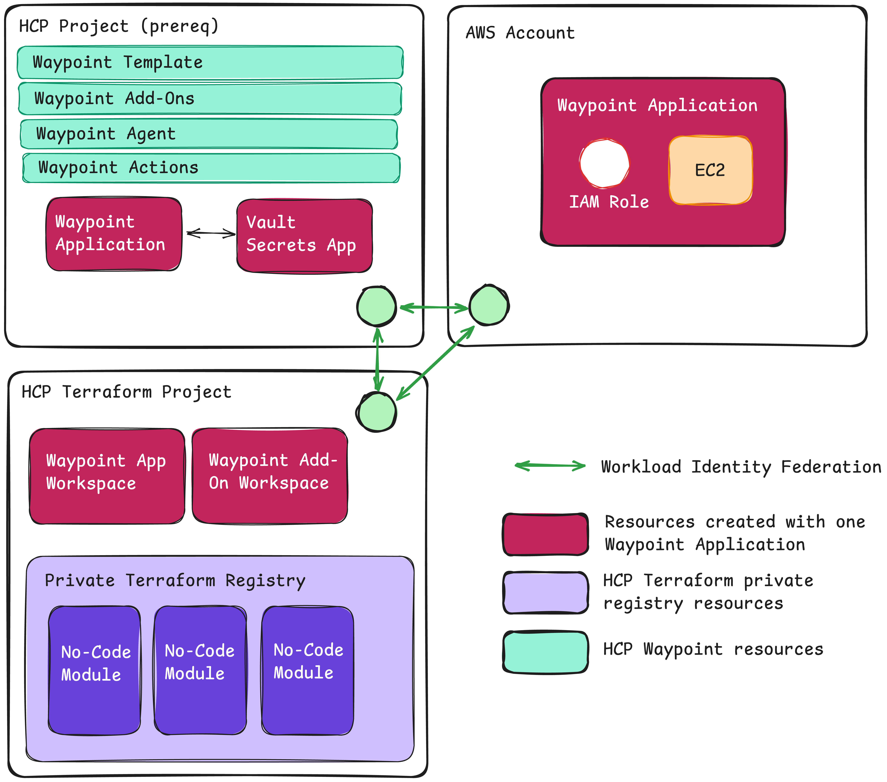

# HashiCorp User Group Göteborg - May 22, 2025

In this demo I set up no-code provisioning modules on HCP Terraform and corresponding resources on HCP Waypoint to allow developer self-service workflows.

## Prerequisites

You need the following:

* Access to an **HCP organization** with the HCP CLI installed ([instructions](https://developer.hashicorp.com/hcp/docs/cli/install)). Authenticate to HCP by running `hcp auth login`.
* Access to an **HCP Terraform organization** with **plus tier** license. Authenticate your Terraform CLI to HCP Terraform by running `terraform login`.
* Access to an AWS account with at least one public Route 53 hosted zone. Install the AWS CLI and configure authentication ([instructions](https://docs.aws.amazon.com/cli/latest/userguide/getting-started-install.html)).
* A GitHub organization (or personal account) that you have already added as a VCS provider to HCP Terraform, and a GitHub PAT with access to this GitHub organization/account provided in the `github_token` variable.

## How to set up the demo

1. Go to the [prereq](./prereq/) directory and run `terraform init && terraform apply`. This provisions a project on HCP and adds the project ID as input to the next step by creating a `./demo/hcp.auto.tfvars` file.
1. Go to the [demo](./demo/) directory and run `terraform init && terraform apply`. This provisions the full demo.

There is currently no support to set up HCP Waypoint **agents** and **agent-based actions** with Terraform. To set these up:

1. Go to your HCP organization and to the **hug** project.
1. Go to HCP Waypoint and click on **Agents**.
1. Click on **Create an agent group**.
1. Set the name to **minecraft** and add any description (the name must be the same as the group in [agent.hcl](./demo/repos/minecraft-server/files/waypoint/agent.hcl))
1. Go back to HCP Waypoint and click on **Actions**.
1. Click **Create an action**.
1. For each action listed in the table below:
    1. Give the action the name as in the table.
    1. Add variables for the action. For each variable you add to the actions, check the **Enable this value to be defined when the action is triggered. You may optionally enter a default value** tick box.
    1. Select **Agent** as the action type.
    1. Select the **minecraft** agent group.
    1. Provide the name of the action according to the table below in the **Action identifier** field.
    1. Click on **Create action**.

| Name    | Description                            | Variable 1                         | Variable 2                       |
| ------- | -------------------------------------- | ---------------------------------- | -------------------------------- |
| say     | Say something in the Minecraft world   | `message` (default value `hello!`) |                                  |
| weather | Set the weather in the Minecraft world | `weather` (default value `rain`)   | `duration` (default value `60s`) |
| time    | Set the time in the Minecraft world    | `time` (default value `day`)       |                                  |
| backup  | Export a backup of the server to S3    |                                    |                                  |

When you are done adding the actions you need to **assign** them to the Minecraft server template.

1. Go to the HCP Waypoint landing page.
1. Go to **Templates**.
1. Open the **Minecraft server template**.
1. Click on **Settings** and then on **Action assignments**.
1. Check each action and then click on **Confirm**.

## How to use the demo

With everything set up, create an **Application** on HCP Waypoint

1. From the HCP Waypoint overview, go to the **Applications** menu.
1. Click **Create application**.
1. Select the Minecraft server template and fill in the details of the form to start creating the application.
1. On the next screen, monitor the status of the creation of the application , and read through the developer instructions.
1. Once the application is provisioned there is an **Outputs** tab, copy the server DNS entry.
1. Open your Minecraft (Java Edition) and connect to the server.

Note that there is a small delay from when the application says it is done until you can connect to the server. This is because the installation of the server application happens asynchronously after the cloud resources are provisioned.

Install **Add-ons** and run **Actions** for the application (the instructions are left out as an exercise for the reader).

## How to destroy the demo

1. Make sure you uninstall all add-ons and delete all HCP Waypoint applications you have created. Also make sure the corresponding HCP Terraform workspaces run their destroy operations and that the workspaces are subsequently deleted.
1. Manually delete all actions and the agent you added in HCP Waypoint.
1. Go to the [demo](./demo/) directory and run `terraform destroy`.
1. Go to the [prereq](./prereq/) directory and run `terraform destroy`.